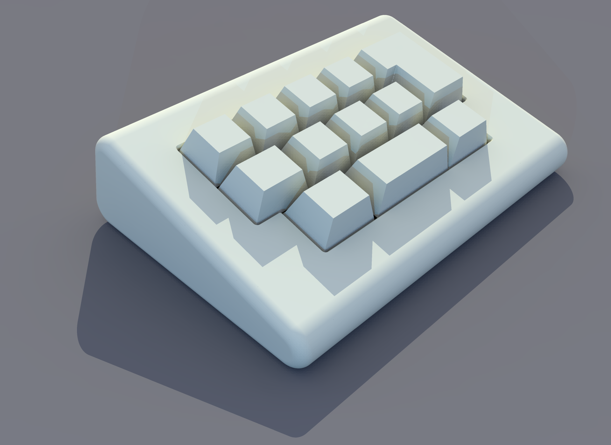

# 5½u Macropad

## 📻 Project Description

A macropad inspired by the look of the iconic beam spring keyboards of the '70s.

## 🧰 Features

- 12× keys
- RP2040 microcontroller
- Powered by QMK with Vial support
- USB-C connector

## 📚 Read more...
- [Design](notes/Design.md)
- [Construction](notes/Construction.md)
- [Firmware](notes/Firmware.md)

---

## 🔗 Inspired by...
- [QAZER_BEAM](https://github.com/ImYourHuckleberry/QAZER_BEAM)
- [IBM Beam Spring Keyboards](https://deskthority.net/wiki/IBM_Beam_Spring_Keyboards#3275_.26_3277)
- [EzyezII Frankenstein](https://ezykeys.com/products/frankenstein-extensible-mini-mechanical-keyboard-kit)
- [Cary Works ViewEdge](https://drop.com/buy/cary-works-viewedge-display-and-c11-macropad)

## 📐 References
- [Raspberry Pi Pico Pinout](https://www.raspberrypi.com/documentation/microcontrollers/raspberry-pi-pico.html#pinout-and-design-files)
- [USB Type-C Breakout](https://www.pololu.com/product/3411)
- [QMK Firmware](https://docs.qmk.fm/)
- [Vial Firmware](https://get.vial.today/)

---