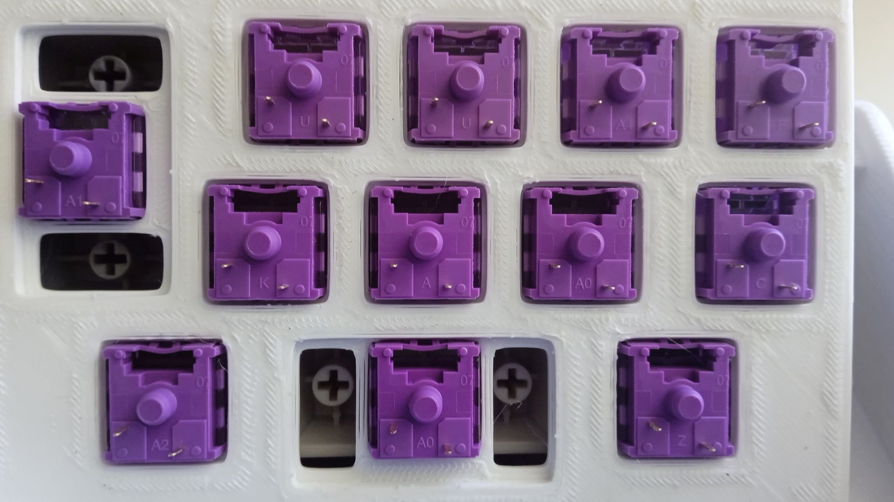

# Construction

## 🛒 Bill of Materials (BOM)

| Item | Size | Qty | 
| ---- | ---- | --- |
| Raspberry Pi Pico | N/A | 1 |
| [USB-C Breakout](https://www.pololu.com/product/3411) | N/A | 1 | 
| MX switches | N/A | 12 |
| Heat Set Inserts | M2 ø3.5×6mm | 6 |
| Heat Set Inserts | M3 ø4x5mm | 4 |
| Screws | M2 | 6 |
| Screws | M3 | 4 |
| Wire | 30AWG | N/A |
| 3D printed shell | N/A | 3 pcs |

## 📸 Photos
The plate is 3.5mm thick. The cutouts are 1.5mm x 14mm and 2.0mm x 15mm. However, in the second photo you can see the switches do not clip in cleanly. For my next plate I'll try changing the plate thickness to 1.4mm + 2.1mm to account for printer tolerances. I included cutouts for stabilizers but I didn't have any suitable pieces on hand to use.

The brackets to hold the boards in place fit decently. If I ever do a rev 2, I'd tighten the USB-C along the long side, and also raise the height slightly. This is to prevent the action of inserting the USB-C connector from dislodging it.

The chamfer for the head of the M3 screws on the bottom lid were not large enough, and the screws stick out slightly. However because I am using adhesive bump-ons this is not a problem.

Additionally, the gap between the lid and the case to account for tolerances looks rather untidy — this is why I opted to have the case conceal the bottom lid when placed right side up.

Here you can see wires have been soldered to the TP pads on the back of the Pico. These connect to the USB-C breakout board. I was worried they would be too hard to solder but 30AWG wire, solder flux and Kapton tape made it managable. 

While this configuration works fine for USB Type-C to Type-A cables, if you wish to use Type-C to Type-C cables you will need resistors on the CC lines.

---
Back: [Design](Design.md) | Next: [Firmware](Firmware.md) | Back to [README.md](../README.md)
