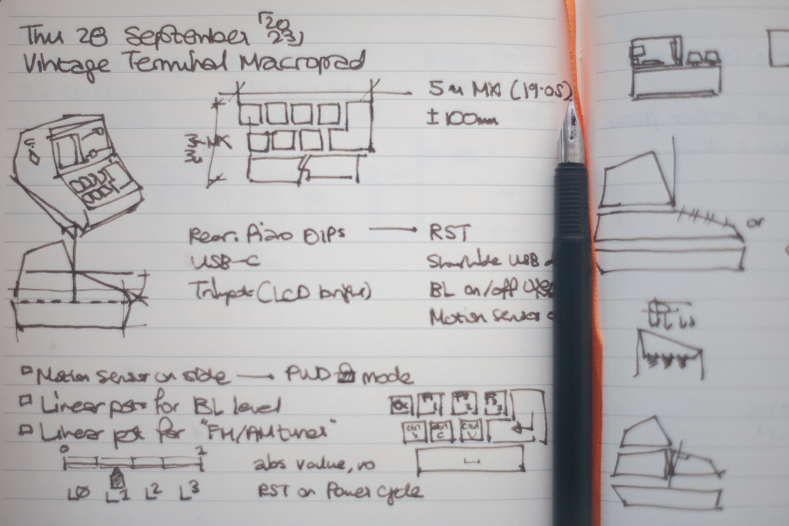
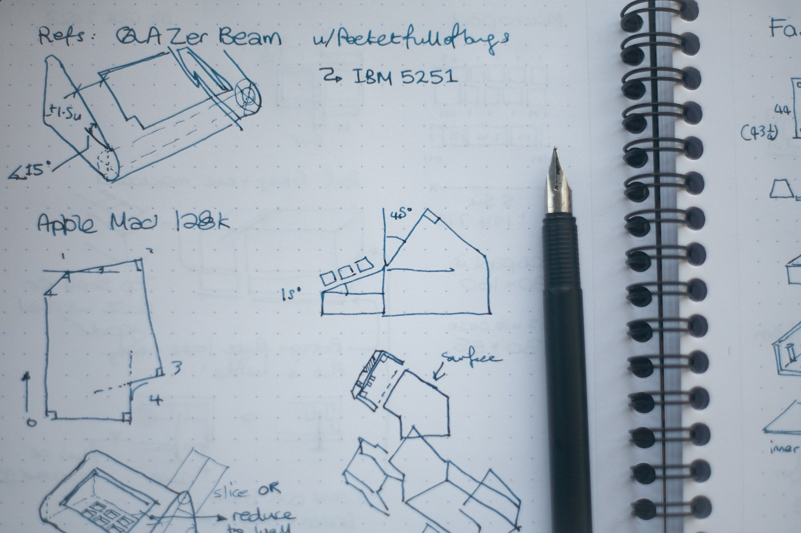
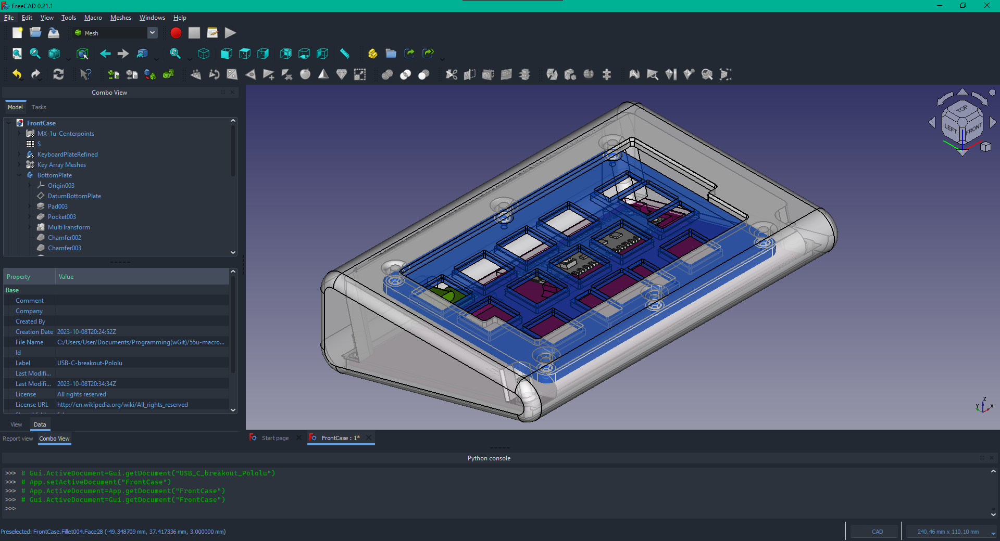

# Design
The original design was a macro pad coupled with a LCD screen that would resemble a '70s or '80s terminal with a small CRT screen set in a bulky case. After some to and fro I decided to focus on the keyboard only as a separate piece.

Heavily inspired by ImYourHuckleberry's [QAZER_BEAM](https://github.com/ImYourHuckleberry/QAZER_BEAM), the aim I had in mind was a macropad that had generous bezels, a significant slope, and oversized round fillets. While it would only have 12 keys, I still wanted the familiar silhouette of a vintage keyboard. Lastly, I wanted the profile to hide the actual switches, with the keycaps sitting almost flush with the top surface.

Once I finished the pen and paper drafting and had a better idea of what I wanted, I used FreeCAD to create the models. 

I decided to create the case as one body, with the plate for the key switches being a separate part. It would be inserted from below and secured using screws into heat-set inserts that would be mounted inside and under the bezels of the case.

The bottom plate, which would be slightly wider than the switch plate, would then follow behind it and be secured in a similar fashion. I did not want the bottom plate visible from the sides, so I placed the heat-set inserts so that the bottom plate would sit sligthly inset into the case once secured.

---

Next: [Construction](Construction.md) | Back to [README.md](../README.md)