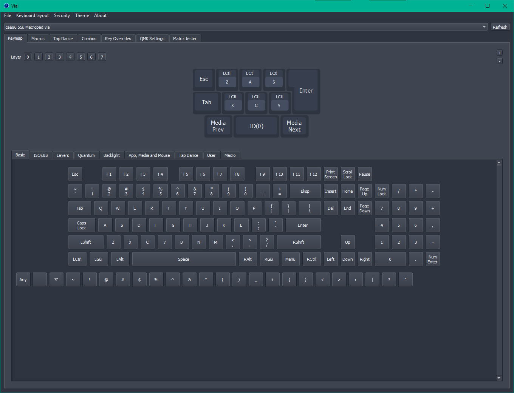
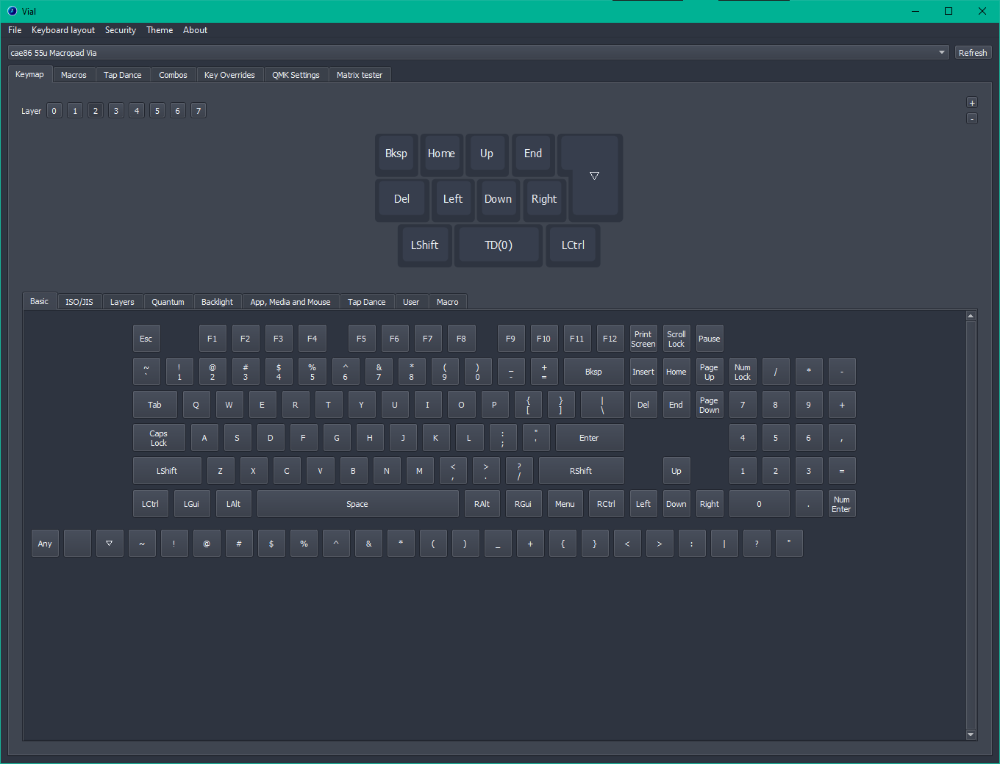

# Firmware
## QMK and Vial
For the firmware I first used the official [QMK](https://docs.qmk.fm/) repo to ensure everything is working and wired up correctly. Once I had the QMK firmware working and flashed to the board, I installed the [Vial](https://get.vial.today/) fork of QMK, and created a Vial-compatible firmware using their instructions.

My initial attempt was to run QMK in a Docker container and then Vial in a separate container, but after some headscratching I instead spun up a new Linux LXC and just cloned both repos without using Docker.

I included the compiled firmware (`55u_macropad_vial.uf2`) for convenience. 

## Closing Thoughts
Like most macropads, I designed this for novelty rather than functionality or practicality. The main uses I have for it right now are having dedicated media keys (prev/pause/next), and having an Escape and Enter key when my main keyboard is connected via KVM to a different PC (since each PC has its own mouse).

I have some hotkeys such as Cut/Copy/Paste and Undo/Select All/Save as well, but I find it easier to just press the two keys on my main keyboard. In my experience having them on your main keyboard as Tap/Hold or Combos works much better.

I've considered adding text editor hotkeys such as column mode select or moving lines up/down, but again, having to move my hand to a separate device *and* having to change layers to use them does not feel very intuitive.

---

Back: [Construction](Construction.md)  | Back to [README.md](../README.md)